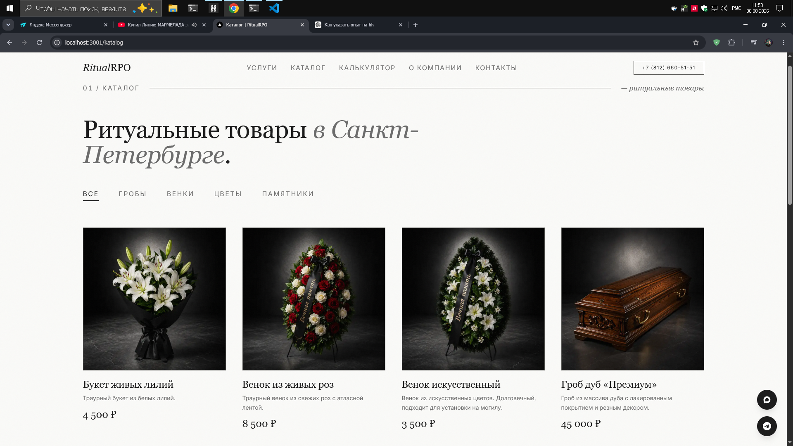
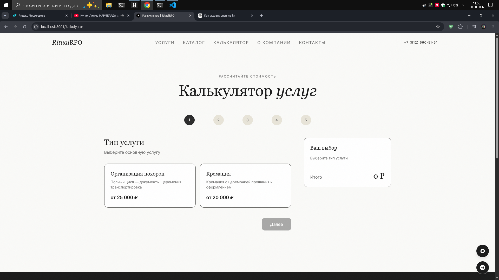
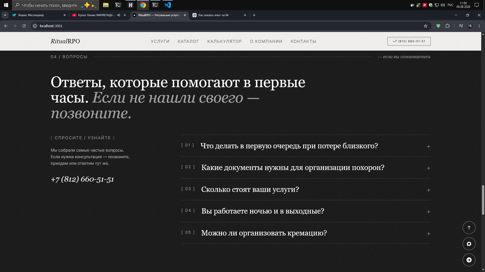

# RitualRPO

Сайт ритуальной службы в Санкт-Петербурге. Он помогает спокойно разобраться в услугах, посмотреть каталог товаров и заранее рассчитать примерную стоимость организации похорон или кремации.

На сайте есть каталог с фильтрами, пошаговый калькулятор, ответы на частые вопросы, отзывы и формы для связи. Контентом можно управлять через отдельную панель администратора.


## Каталог

Товары разделены по категориям. Для каждой позиции указаны фотография, краткое описание и цена.



## Калькулятор

Калькулятор помогает по шагам выбрать нужные услуги и увидеть предварительную стоимость.



## Полезная информация

На главной странице собраны ответы на частые вопросы и все способы связи со службой.




## Технологии

Next.js, React, TypeScript и Tailwind CSS. Данные приходят из отдельного NestJS API.

## Запуск

В корне проекта:

```powershell
docker compose up -d
```

После запуска сайт доступен по адресу http://localhost:3001.
